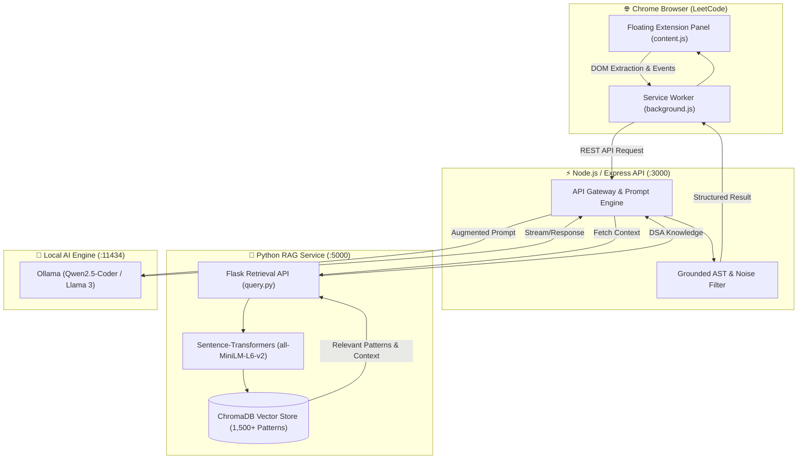

# ⚡ DSA Mentor — AI Copilot & Chrome Extension for LeetCode

> An intelligent, context-aware Chrome extension that provides **tiered hints**, **grounded debugging**, and **algorithmic guidance** on LeetCode without spoiling full solutions. Powered by a local **Retrieval-Augmented Generation (RAG)** pipeline and local LLMs (Ollama / Qwen2.5-Coder).

---

## 🌟 Key Features

* **💡 Multi-Tier Progressive Hints (Levels 1 → 4):**
  * **Level 1:** Core pattern identification (< 8 words).
  * **Level 2:** Conceptual explanation of *why* the approach works.
  * **Level 3 & 4:** Nuanced algorithmic logic and the critical "aha moment" step without revealing code syntax.
* **🐞 Grounded Code Debugging:**
  * Analyzes the user's active code attempt.
  * Filters boilerplate code and pinpoints exact loop, condition, or boundary flaw with an edge-case test recommendation.
* **📊 Time & Space Complexity Analyzer:**
  * Calculates current code complexity ($O(N)$, $O(\log N)$) vs optimal achievable complexity.
* **🧠 Optimal Strategy Explainer:**
  * Context-aware breakdown of the most optimal DSA approach using vector-retrieved algorithm patterns.
* **🎨 Modern Floating UI:**
  * Dark-mode, glassmorphism panel injected directly into LeetCode with request deduplication, client-side caching, and minimization support.

---

## 🏗️ System Architecture



---

## 🛠️ Tech Stack

* **Frontend:** JavaScript (ES6+), Chrome Extension Manifest V3, Web Mutation Observers, Custom CSS3 Dark Glass UI.
* **Backend Gateway:** Node.js, Express.js, Axios, CORS.
* **RAG & Vector Database:** Python 3.11, Flask, ChromaDB, `sentence-transformers` (`all-MiniLM-L6-v2`).
* **LLM & Inference:** Ollama (`qwen2.5-coder:7b` / `llama3.1` / `deepseek-coder`).

---

## 📁 Repository Structure

```text
├── extension/          # Chrome Extension (Manifest V3)
│   ├── manifest.json   # Extension configuration & permissions
│   ├── content.js      # DOM extractor, panel injector & UI state
│   ├── background.js   # Background service worker proxy
│   └── popup.html      # Action popup
├── backend/            # Express.js API Server
│   ├── server.js       # Prompt synthesis, grounding & Ollama integration
│   └── package.json    # Node dependencies
├── rag/                # Python RAG Knowledge Pipeline
│   ├── query.py        # Flask context retrieval microservice
│   ├── ingest.py       # ChromaDB embedding & ingestion pipeline
│   ├── patterns.json   # Curated algorithmic pattern datasets
│   └── dsa_db/         # Persistent ChromaDB vector database
├── docs/               # System architecture documentation
├── SYSTEM_DESIGN.md    # Detailed Mermaid DFDs (Level 0, 1, 2)
└── README.md           # Project documentation
```

---

## 🚀 Quick Start Guide

### Prerequisites
* [Node.js](https://nodejs.org/) (v18+)
* [Python](https://www.python.org/) (v3.10+)
* [Ollama](https://ollama.ai/) with `qwen2.5-coder:7b` installed:
  ```bash
  ollama run qwen2.5-coder:7b
  ```

---

### Step 1: Start the RAG Vector Service
```bash
cd rag
pip install flask flask-cors chromadb sentence-transformers
python query.py
```
*RAG server starts at `http://localhost:5000`*

---

### Step 2: Start the Backend API Server
```bash
cd backend
npm install
npm start
```
*Backend runs at `http://localhost:3000`*

---

### Step 3: Load the Chrome Extension
1. Open Google Chrome and go to `chrome://extensions/`.
2. Enable **Developer mode** in the top-right corner.
3. Click **Load unpacked** and select the [`extension/`](./extension) directory.

---

### Step 4: Test Live on LeetCode
1. Open any problem on [LeetCode](https://leetcode.com/problems/two-sum/).
2. Click the **⚡ DSA Mentor** toggle widget in the bottom-right corner.
3. Request a hint, debug your current code attempt, or analyze complexity in real time!

---

## 🔒 Design & Privacy Principles
* **100% Local Inference:** Code snippets and user solutions are processed locally through Ollama and local ChromaDB — zero data is sent to external proprietary cloud APIs.
* **Anti-Spoil Mentoring:** System prompts are strictly engineered to offer guided mental models and edge cases rather than spitting out complete copy-paste solutions.

---

## 📄 License
MIT License. Feel free to use and customize!
