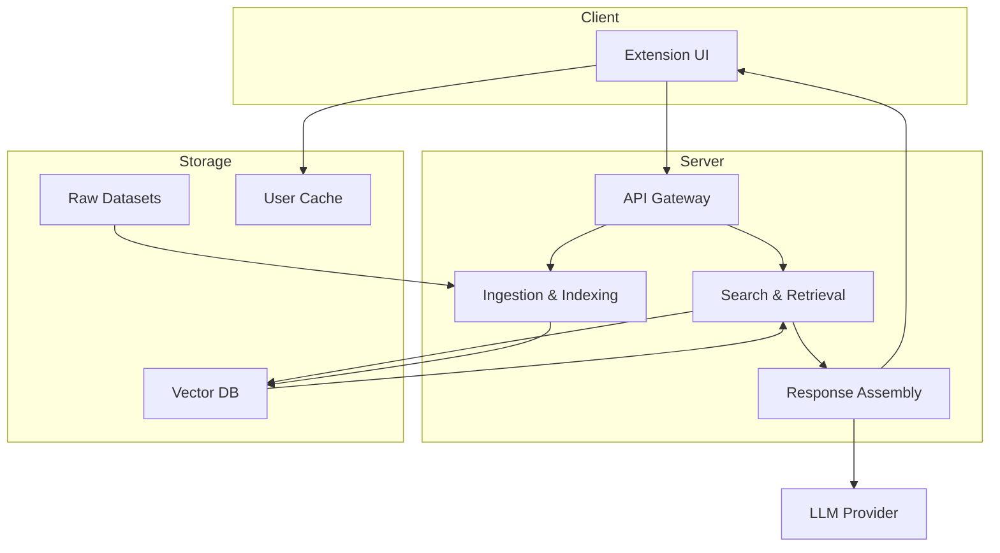
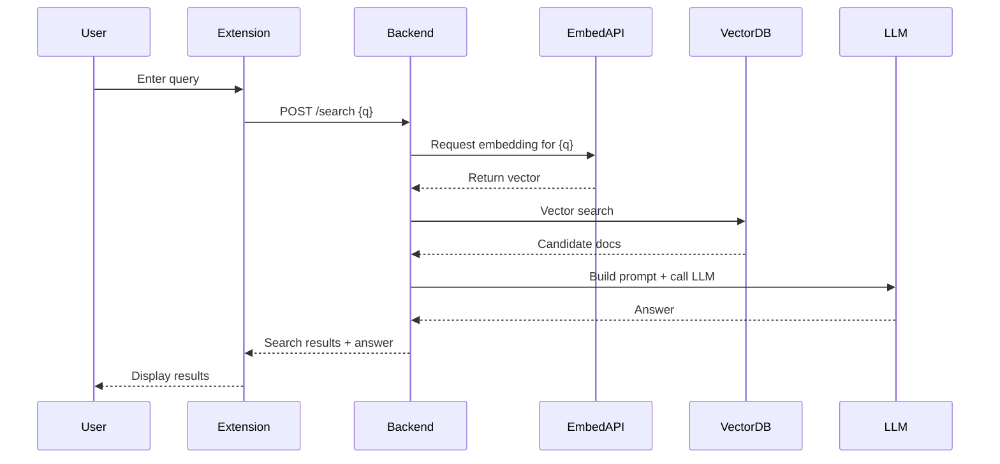

# System Design — Pictorial DFDs

This file contains pictorial representations (Mermaid diagrams) of the system architecture and detailed DFD levels for the project.

## How to view
- Use a Markdown viewer that supports Mermaid (VS Code + Mermaid Preview, GitHub renderers that support Mermaid, or mermaid-cli to export PNG/SVG).

## Context Diagram (DFD Level 0)
```mermaid
graph LR
  User[User]
  Extension[Browser Extension]
  Backend[Backend API (server.js)]
  RAGDB[RAG DB / Vector Store]
  LLM[LLM / Embedding Provider]

  User -->|search/query| Extension
  Extension -->|API requests| Backend
  Backend -->|vector ops| RAGDB
  Backend -->|embed / generate| LLM
  RAGDB -->|retrieved contexts| Backend
  LLM -->|generated answer| Backend
  Backend -->|results| Extension
  Extension -->|display| User
```

## DFD Level 1 — Top-level Processes


## DFD Level 2 — Search/RAG Detailed Flow
```mermaid
graph LR
  Q[User Query]
  Q --> N[Query Normalization]
  N --> EReq[Embedding Request]
  EReq -->|vector| VSearch[Vector Search (Chroma)]
  VSearch --> Candidates[Candidate Passages]
  Candidates --> Scoring[Scoring & Context Build]
  Scoring --> Prompt[Prompt Template]
  Prompt --> LLM[LLM Invocation]
  LLM --> Post[Post-process & Cache]
  Post --> Return[Return Answer to Client]
```

## Sequence Diagram — Typical Search Request


## Notes & Next Steps
- These diagrams are provided as Mermaid markup so you can edit, extend, or export them.
- I can export these diagrams to PNG/SVG and add them under `docs/` if you want visual image files.
- I can also embed these diagrams into a formal `SYSTEM_DESIGN.pdf` or update the repository README.
